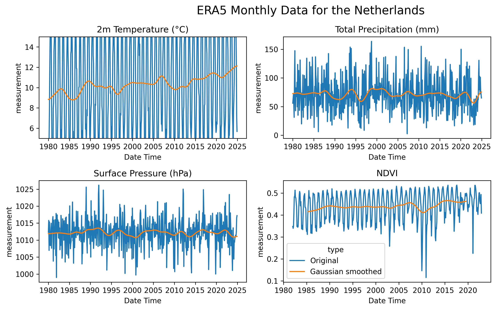

# stress_prediction
This repo detects drought stress and use machine learning to predict stress levels
> **Status:** Work in progress. Please open issues/PRs for bugs or ideas!

- Reprojects & resamples NDVI to ERA5 grid (lat/lon)
- Aligns monthly timestamps
- (Optional) computes *VCI* per pixel & calendar month
- Saves merged NetCDF

