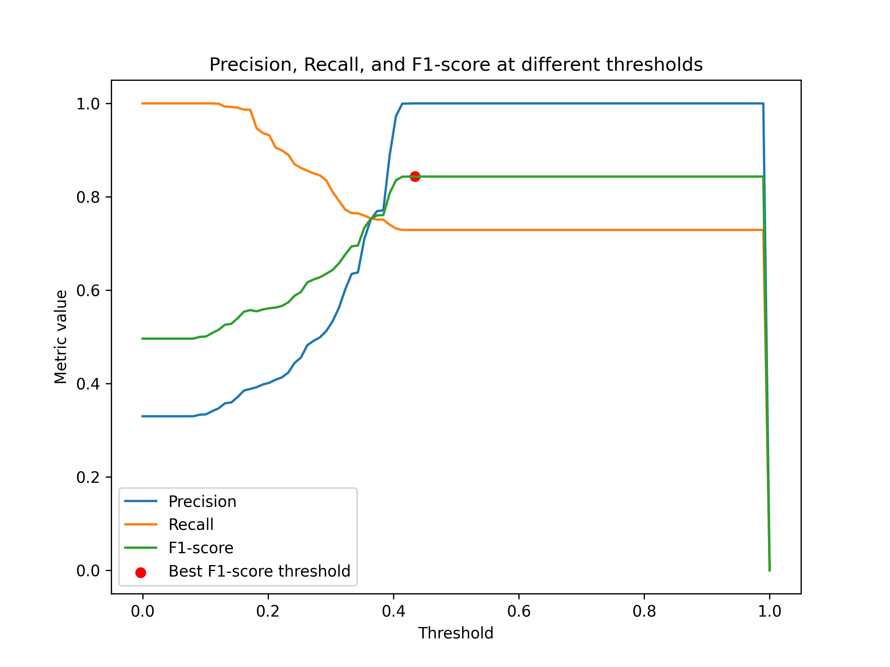
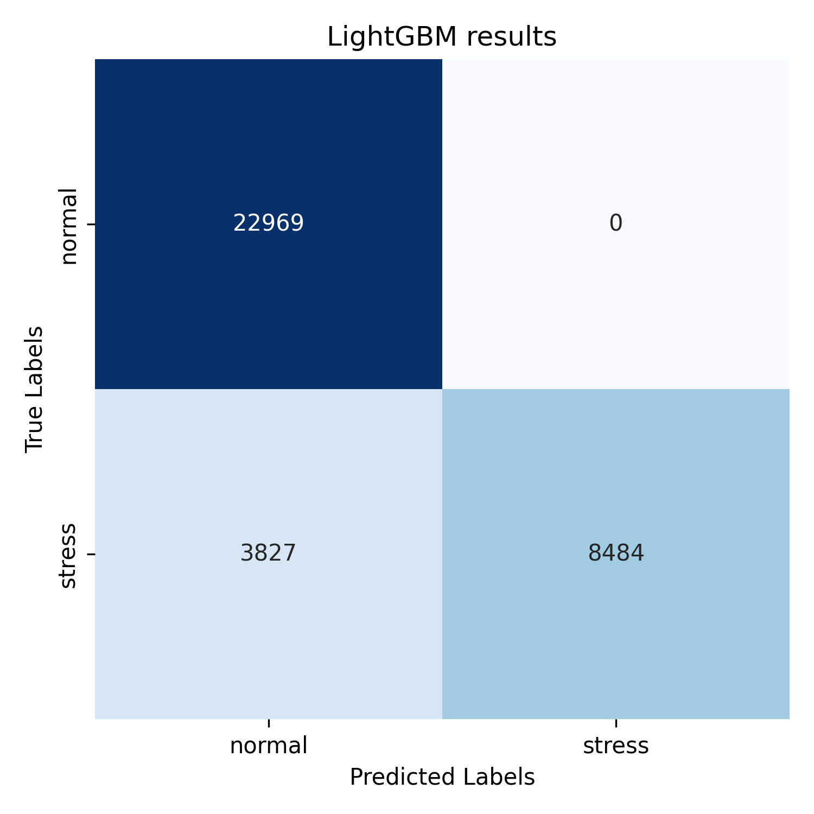
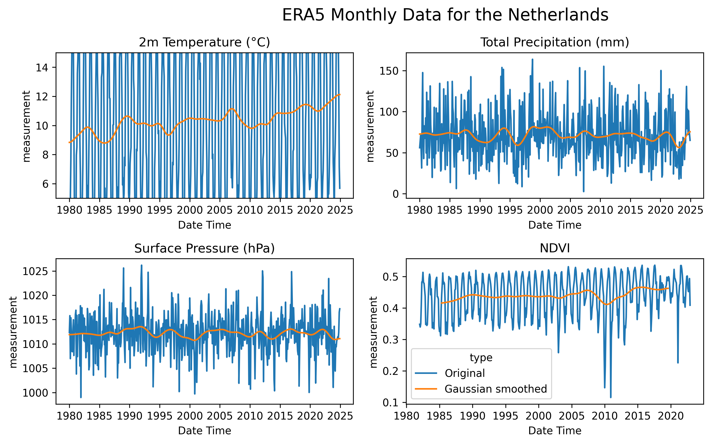

# Drought Stress Detection
A machine learning approach to detect and predict vegetation stress levels using NDVI-derived Vegetation Condition Index (VCI) and climate variables.

## Overview
This project combines satellite-derived vegetation indices (NDVI) with ERA5 climate data to detect plant stress conditions, using LightGBM for prediction.

## Data Pipeline
1. **Data Preprocessing**
   - Merges ERA5 climate data with NDVI observations
   - Reprojects NDVI to ERA5 grid (lat/lon coordinates)
   - Aligns monthly timestamps
   - Computes Vegetation Condition Index (VCI) per pixel & calendar month

2. **Feature Engineering**
   - VCI (Vegetation Condition Index): Normalized NDVI indicating vegetation health
   - Climate variables from ERA5 (temperature, precipitation)
   - Derived drought indices (SPI, TCI)

3. **Model**
   - Uses LightGBM for stress level classification
   - Optimizes threshold selection on validation set
   - Predicts binary stress/no-stress conditions

## Results
### Validation Performance

*F1 score optimization for stress detection threshold*

### Test Set Performance

*Final model performance on test set*

## Time Series Analysis

*Time series of drought indicators and stress detection*

> **Status:** Work in progress. Adding transformer based models. 