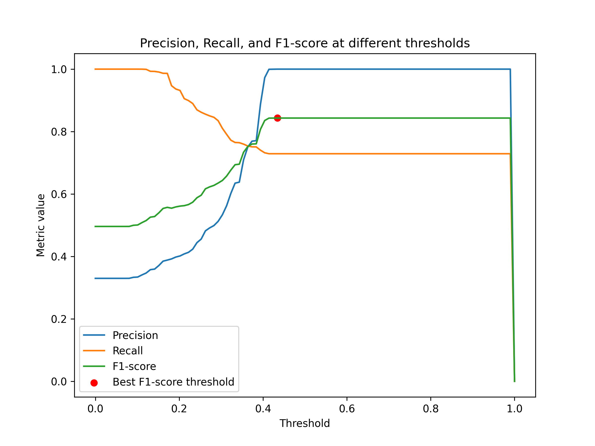
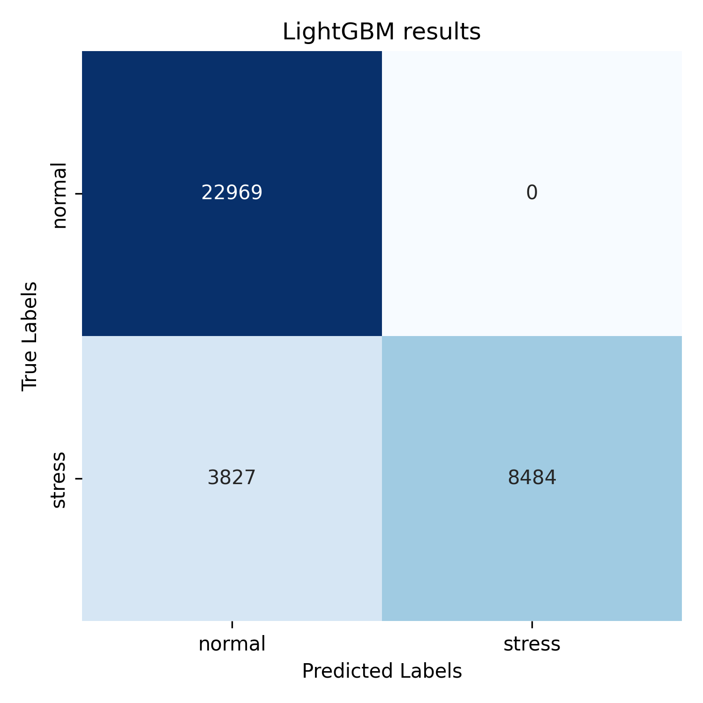
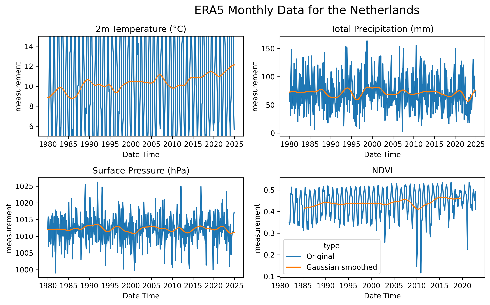

# Drought Stress Prediction

Train a LightGBM classifier to forecast vegetation stress from monthly NDVI and
ERA5 climate variables. The supported workflow is an internal, reproducible CLI
application managed with `uv`.

## Setup

Install `uv`, then create the locked Python 3.11 environment:

```powershell
uv sync --locked --group dev
uv run stress-prediction --help
```

`pyproject.toml` defines compatible dependency ranges. `uv.lock` is committed
and is the exact environment used by development and CI.

Optional dependencies are available for the geospatial pipeline and the
experimental neural models:

```powershell
uv sync --locked --extra geo
uv sync --locked --extra nn
```

## Input Data

LightGBM training expects a CSV with one monthly observation per spatial point:

- `valid_time`
- `latitude`
- `longitude`
- `vegetation_stress_class`
- `tp_mm`
- `pet_mm`
- `T_c`
- `ndvi`

Supported stress labels are `normal`, `mild`, `moderate`, and `severe`.
Duplicate `(latitude, longitude, valid_time)` observations, missing feature
values, and unknown labels are rejected before training.

Raw climate and vegetation datasets are not distributed in the Python package.
Copernicus CDS credentials are required for ERA5 downloads.

## Train

```powershell
uv run stress-prediction train-lgb `
  --input data/drought_indices.csv `
  --output-dir experiments/lightgbm `
  --n-lags 12 `
  --horizon 6 `
  --validation-start 2016-01-01 `
  --test-start 2019-01-01 `
  --trials 30 `
  --seed 42
```

Splits use the future label timestamp, rather than the feature timestamp, to
prevent labels across a temporal cutoff from leaking into an earlier partition.
The decision threshold is selected only from validation data.

Training writes:

- `model.pkl`: trusted internal model bundle containing the estimator,
  threshold, feature order, configuration, versions, metrics, and data hash.
- `metrics.json`: validation and test metrics for inspection and automation.
- `precision_recall.png`: validation and test precision-recall curves, including
  the validation-selected operating point.
- `confusion_matrix.png`: test predictions at the selected threshold.
- `feature_importance.png`: the 20 most important LightGBM features.

Only load `model.pkl` files produced by a trusted training run. Python pickle
artifacts are not safe to load from untrusted sources.

## Results

The original research run shows the expected threshold trade-off and compares
the LightGBM classifier with a logistic-regression baseline:

| Validation threshold selection | Held-out test evaluation |
| --- | --- |
|  |  |

These two panels are retained as **historical exploratory results**. They
predate the packaged workflow and do not include the model bundle, data hash,
seed, or dependency lock needed to claim them as the current benchmark.

Every new `train-lgb` run now records the validation-selected threshold, split
sizes, validation and test metrics, input-data SHA-256, package versions, and
the three evaluation figures listed above. A benchmark should be reported from
those run artifacts together with its command and `metrics.json`; this keeps
the README results traceable rather than copying unverified numbers into it.

The underlying ERA5 series provides useful context for the climate inputs and
their seasonal structure:



## Predict

Prediction input uses the same climate and location columns as training, but it
does not need `vegetation_stress_class`:

```powershell
uv run stress-prediction predict `
  --artifact experiments/lightgbm/model.pkl `
  --input data/current_observations.csv `
  --output experiments/lightgbm/predictions.csv
```

The output contains location, observation time, forecast target time, stress
probability, and binary prediction. CSV and Parquet outputs are supported;
Parquet requires the `geo` extra.

## Development

```powershell
uv run ruff format --check src/stress_prediction tests
uv run ruff check src/stress_prediction tests
uv run mypy src/stress_prediction
uv run pytest --cov=stress_prediction
uv build
```

The PyTorch sequence models and the original geospatial preparation scripts are
still experimental and are not part of the production support contract yet.